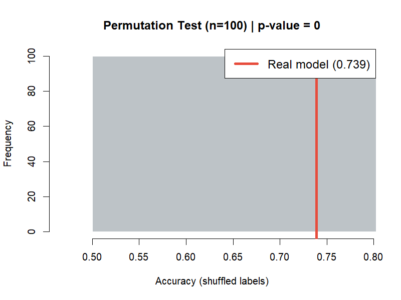
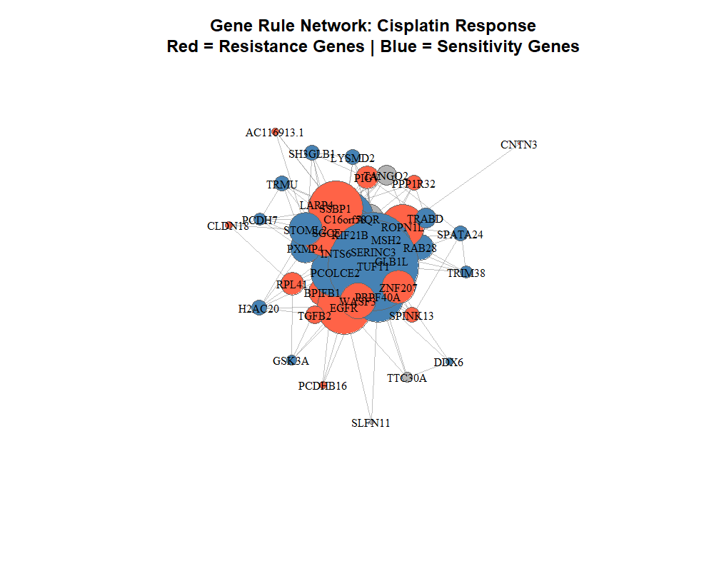
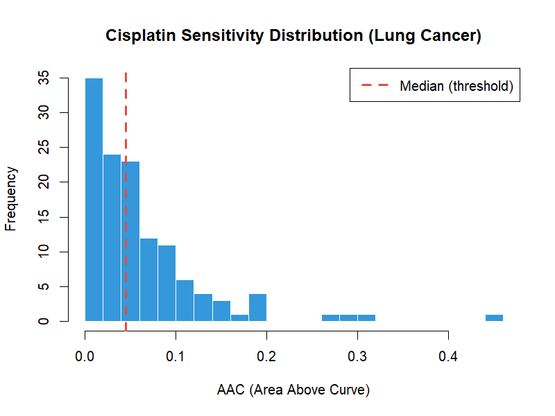
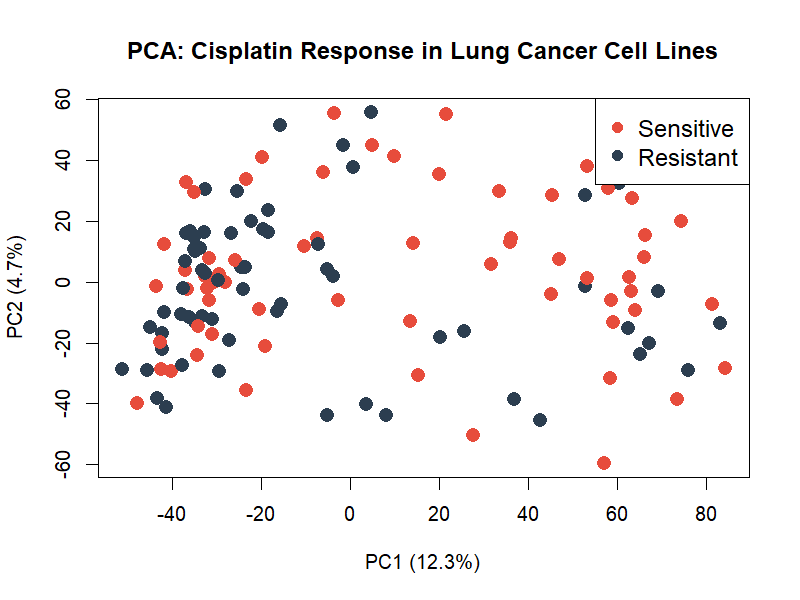
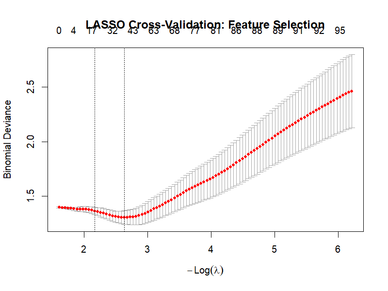

<h1 align="center">Interpretable Rule-Based Prediction of Cisplatin Response in Lung Cancer</h1>

<p align="center">
  
  
  
  
  
  
</p>

<p align="center">
  <b>A rough set-based interpretable machine learning approach to cancer pharmacogenomics</b>
</p>

---

## Abstract

Cisplatin is the most widely prescribed chemotherapy for non-small cell lung cancer, yet approximately 60% of patients exhibit intrinsic or acquired resistance. Existing predictive models based on neural networks and support vector machines achieve reasonable accuracy but function as black boxes, offering no mechanistic insight into the molecular basis of drug response.

This study applies **R.ROSETTA**, a rough set-based classification framework, to gene expression profiles of 127 lung cancer cell lines from the Genomics of Drug Sensitivity in Cancer (GDSC2) database. The resulting model produces **human-readable IF-THEN rules** that identify specific gene expression patterns associated with cisplatin sensitivity and resistance.

The model achieves **73.9% classification accuracy** (permutation p-value < 0.01), comparable to black-box methods, while providing fully interpretable combinatorial rules. Key findings include the identification of EGFR, SLFN11, and MSH2 in rule sets consistent with established literature, alongside novel candidate biomarkers including TUFT1, SERINC3, and PRPF40A.

---

## Results

### Model Performance

| Metric | Value |
|:-------|:------|
| Classification Accuracy (10-fold CV) | 73.9% |
| Accuracy Range | 61.5% - 92.3% |
| Standard Deviation | 0.082 |
| Permutation p-value | < 0.01 (n = 100) |
| Total Rules Generated | 241 |
| Samples | 127 lung cancer cell lines |
| Input Features | 43 genes (reduced from 17,611) |
| Class Distribution | Sensitive (n = 64), Resistant (n = 63) |

### Statistical Validation

The permutation test confirms the model significantly outperforms random classification (mean shuffled accuracy = 51.7%).

<p align="center">
  
  <br>
  <i>Figure 1. Permutation test results (n = 100). Red line indicates real model accuracy (73.9%). Histogram shows accuracy distribution under random label permutation.</i>
</p>

### Representative Rules

| Rule | Decision | Accuracy | Support |
|:-----|:---------|:--------:|:-------:|
| WASF3 = high AND PRPF40A = high | Sensitive | 100% | 20 |
| SSBP1 = low AND PRPF40A = low | Resistant | 100% | 19 |
| KIF21B = low AND SERINC3 = high | Resistant | 100% | 17 |
| TUFT1 = low AND GSK3A = high | Sensitive | 100% | 17 |
| EGFR = high AND STOML2 = low | Resistant | 100% | 16 |
| SLFN11 = high AND PRPF40A = high | Sensitive | 100% | 13 |
| MSH2 = high AND PCOLCE2 = high | Sensitive | 100% | 12 |

The complete set of 241 rules with full statistics is available in [`cisplatin_rules.csv`](cisplatin_rules.csv).

---

## Biological Findings

### Validated Gene Associations

| Gene | Observed Role | Number of Rules | Supporting Literature |
|:-----|:-------------|:---------------:|:---------------------|
| **EGFR** | Resistance | 21 | EGFR-driven lung cancers exhibit well-documented platinum resistance (Lynch et al., 2004) |
| **SLFN11** | Sensitivity | Multiple | Established cisplatin sensitivity biomarker; silencing confers resistance (Zoppoli et al., 2012) |
| **MSH2** | Sensitivity | Multiple | DNA mismatch repair proficiency enhances cisplatin-induced apoptosis (Fink et al., 1996) |
| **TGFB2** | Sensitivity | Multiple | TGF-beta signaling modulates chemosensitivity in NSCLC |

### Novel Candidate Biomarkers

| Gene | Network Role | Number of Rules | Observation |
|:-----|:-------------|:---------------:|:------------|
| **TUFT1** | Central hub | 35 | Most connected gene in the rule network; bridges resistance and sensitivity clusters |
| **SERINC3** | Major connector | 30 | Second-most connected gene; serine incorporator with no prior cisplatin association |
| **PRPF40A** | Sensitivity co-predictor | 20 | Pre-mRNA processing factor; appears in high-confidence sensitivity rules |
| **C16orf58** | Dual-role hub | 22 | Appears in both resistance and sensitivity rule contexts |

### Rule Network

Nodes represent genes; edges represent co-occurrence within rules. Node size is proportional to the number of rules containing that gene. Red nodes indicate predominant association with resistance; blue nodes indicate predominant association with sensitivity.

<p align="center">
  
  <br>
  <i>Figure 2. Gene co-occurrence network derived from 241 cisplatin response rules. TUFT1 (35 rules) and SERINC3 (30 rules) are the principal hub genes. EGFR clusters with resistance-associated genes (red), while SLFN11, MSH2, and PRPF40A associate with sensitivity (blue).</i>
</p>

---

## Methods

The analysis follows the rule-based model development pipeline described by Komorowski (2023).

### Pipeline Overview

```
Step 1  Biological Question       Predict cisplatin sensitivity in lung cancer
Step 2  Data Acquisition          GDSC2 database via PharmacoGx (127 cell lines, 17,611 genes)
Step 3  Preprocessing             NA imputation (gene median), variance filtering (bottom 25%
                                  removed), z-score normalization
Step 4  Feature Selection         LASSO (34 genes) and Boruta (11 genes); union = 43 genes
Step 5  Discretization            Equal frequency binning into three levels (low, medium, high)
Step 6  Classification            R.ROSETTA with StandardVoter classifier, Johnson reducer,
                                  10-fold cross-validation
Step 7  Statistical Validation    Permutation test (100 iterations, p < 0.01)
Step 8  Post-processing           Rule extraction, co-occurrence network construction,
                                  hub gene identification
```

### Data Source

Gene expression (microarray, RMA-normalized) and cisplatin dose-response data (area above the dose-response curve, AAC) were obtained from the Genomics of Drug Sensitivity in Cancer project (GDSC2, release v2-8.2) via the PharmacoGx R package. Cell lines were classified as Sensitive (AAC >= median) or Resistant (AAC < median).

<p align="center">
  
  <br>
  <i>Figure 3. Distribution of cisplatin sensitivity (AAC) across 127 lung cancer cell lines. Dashed red line indicates the median threshold used for binary classification.</i>
</p>

### Preprocessing and Normalization

Starting from 17,611 genes across 127 samples, the preprocessing pipeline removed genes with missing values exceeding 20% of samples, imputed remaining missing values using per-gene median, removed the bottom 25% of genes by variance, and applied z-score normalization. Principal component analysis confirmed the absence of extreme outliers.

<p align="center">
  
  <br>
  <i>Figure 4. PCA of preprocessed gene expression data (13,208 genes). PC1 captures 12.3% and PC2 captures 4.7% of total variance. No distinct outliers were identified for removal.</i>
</p>

### Feature Selection

Two complementary methods were applied to reduce dimensionality from 13,208 to 43 genes:

**LASSO** (L1-regularized logistic regression): 10-fold cross-validated at lambda.min; selected 34 genes including EGFR, SLFN11, and SSBP1.

**Boruta** (random forest wrapper): Applied to the top 1,000 most variable genes with 200 iterations; confirmed 11 genes including MSH2, TGFB2, and GSK3A.

The union of both feature sets (43 genes) was used as input to R.ROSETTA, following the guideline recommendation to combine multiple feature selection approaches to mitigate the shadowing effect where dominant features suppress weaker but biologically relevant signals.

<p align="center">
  
  <br>
  <i>Figure 5. LASSO cross-validation curve. Optimal regularization at lambda.min selected 34 non-zero coefficients.</i>
</p>

---

## Repository Structure

```
cisplatin-rbm-lung-cancer/
|
|-- README.md                   Project documentation
|-- LICENSE                     Apache License 2.0
|-- analysis.R                  Complete reproducible R script
|-- MODEL_SUMMARY.txt           Model performance summary
|
|-- images/
|   |-- pca_plot.png            Principal component analysis
|   |-- cisplatin_distribution.png  Drug sensitivity distribution
|   |-- lasso_cv.png            LASSO cross-validation curve
|   |-- permutation_test.png    Permutation test histogram
|   |-- rule_network.png        Gene co-occurrence network
|
|-- cisplatin_rules.csv         All 241 rules with statistics
|-- expression_data.csv         Normalized expression matrix (127 x 43)
|-- response_labels.csv         Sample classification labels
|-- lasso_features.csv          LASSO-selected genes with annotations
|-- boruta_features.csv         Boruta-selected genes with annotations
|-- network_edges.csv           Rule co-occurrence network edge list
```

---

## Reproducing the Analysis

### Prerequisites

```r
install.packages(c("BiocManager", "glmnet", "Boruta", "igraph", "devtools"))
BiocManager::install("PharmacoGx")
devtools::install_github("komorowskilab/R.ROSETTA")
```

### Execution

```r
source("analysis.R")
```

The initial run downloads approximately 1.5 GB of GDSC2 data and requires 15-30 minutes for the download step. The complete analysis including feature selection, model training, and permutation testing takes approximately 60-90 minutes on a standard desktop machine.

---

## Comparison with Existing Approaches

| Method | Typical Accuracy | Interpretable | Mechanism Discovery | Reference |
|:-------|:----------------:|:-------------:|:-------------------:|:----------|
| Deep Neural Networks | 75-80% | No | No | Sakellaropoulos et al., 2019 |
| Random Forest | 72-78% | No | Partial | Iorio et al., 2016 |
| Elastic Net | 70-76% | Partial | No | Garnett et al., 2012 |
| SVM | 70-75% | No | No | Geeleher et al., 2014 |
| **R.ROSETTA (this study)** | **73.9%** | **Yes** | **Yes** | -- |

The principal advantage of the rule-based approach is not superior accuracy but the generation of interpretable, combinatorial hypotheses that can be directly tested experimentally and communicated to domain experts without requiring computational expertise.

---

## References

1. Draminski, M. et al. "R.ROSETTA: an interpretable machine learning framework." *BMC Bioinformatics* 22, 110 (2021).
2. Komorowski, J. "Developing RBMs -- Guidelines." Knowledge-based Systems in Bioinformatics, Winter 2023.
3. Yang, W. et al. "Genomics of Drug Sensitivity in Cancer (GDSC): a resource for therapeutic biomarker discovery in cancer cells." *Nucleic Acids Research* 41, D955-D961 (2013).
4. Zoppoli, G. et al. "Putative DNA/RNA helicase Schlafen-11 (SLFN11) sensitizes cancer cells to DNA-damaging agents." *PNAS* 109, 15030-15035 (2012).
5. Fink, D. et al. "The role of DNA mismatch repair in platinum drug resistance." *Cancer Research* 56, 4881-4886 (1996).
6. Lynch, T.J. et al. "Activating mutations in the epidermal growth factor receptor underlying responsiveness of non-small-cell lung cancer to gefitinib." *New England Journal of Medicine* 350, 2129-2139 (2004).
7. Sakellaropoulos, T. et al. "A deep learning framework for predicting response to therapy in cancer." *Cell Reports* 29, 3367-3373 (2019).
8. Iorio, F. et al. "A landscape of pharmacogenomic interactions in cancer." *Cell* 166, 740-754 (2016).

---

## License

This project is licensed under the Apache License 2.0. See [`LICENSE`](LICENSE) for full terms.

---

<p align="center">
  <i>Analysis conducted using R.ROSETTA  |  Data sourced from GDSC2  |  Pipeline based on Komorowski RBM Guidelines</i>
</p>
